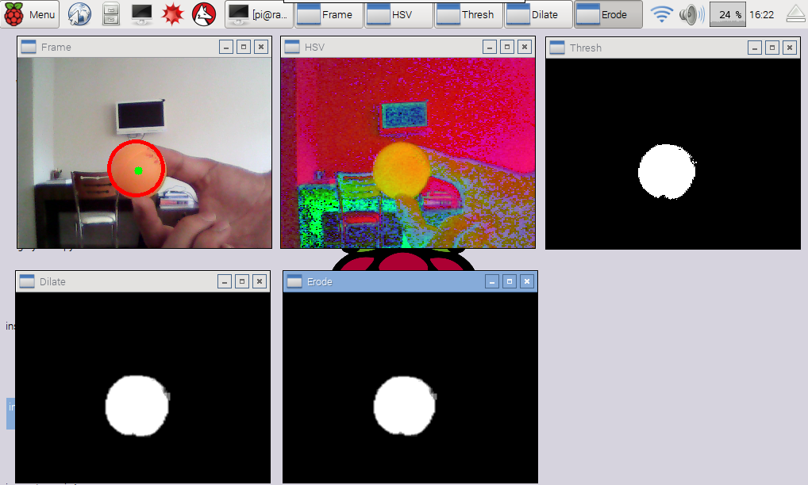
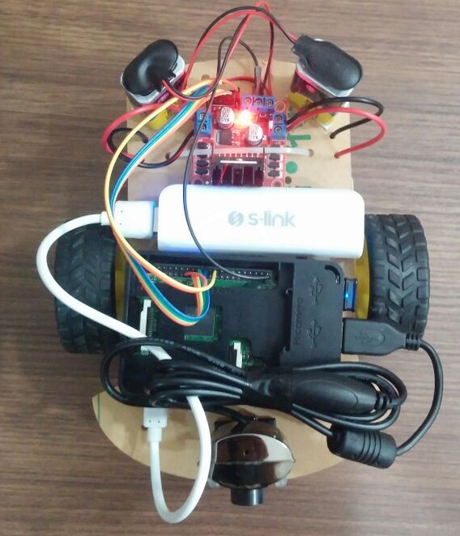

# Inspecto Raspi - Object Tracking by Using OpenCV




## Inspecto Raspi Project

This project involves using a Raspberry Pi for object tracking with OpenCV, controlling LEDs, DC motors, and performing various image processing tasks.

## Table of Contents

- [Inspecto Raspi - Object Tracking by Using OpenCV](#inspecto-raspi---object-tracking-by-using-opencv)
  - [Inspecto Raspi Project](#inspecto-raspi-project)
  - [Table of Contents](#table-of-contents)
  - [Prerequisites](#prerequisites)
  - [Project Descriptions](#project-descriptions)
    - [LED Blink](#led-blink)
    - [LED PWM](#led-pwm)
    - [DC Motor PWM](#dc-motor-pwm)
    - [Edge Detection](#edge-detection)
    - [Grayscale Conversion](#grayscale-conversion)
    - [InspectorASPI](#inspectoraspi)
  - [Electronics Schematic](#electronics-schematic)
    - [Schematic Description](#schematic-description)
    - [Example Schematic Layout](#example-schematic-layout)
  - [Setup and Usage](#setup-and-usage)
  - [License](#license)

## Prerequisites

- Raspberry Pi with Raspbian OS
- Python 3
- RPi.GPIO library
- OpenCV library (for image processing projects)

## Project Descriptions

### LED Blink

The [`led_blink.py`](led_blink.py) script blinks an LED connected to a specified GPIO pin.

### LED PWM

The [`led_pwm.py`](led_pwm.py) script demonstrates Pulse Width Modulation (PWM) to control the brightness of an LED.

### DC Motor PWM

The [`dc_motor_pwm.py`](dc_motor_pwm.py) script controls the speed of a DC motor using PWM.

### Edge Detection

The [`edge_detection.py`](edge_detection.py) script performs edge detection on video frames captured from a webcam.

### Grayscale Conversion

The [`grayscale.py`](grayscale.py) script tracks a red ball and performs grayscale conversion on video frames.

### InspectorASPI

The [`inspectoraspi.py`](inspectoraspi.py) script performs object tracking using OpenCV and controls DC motors based on the detected object's position.

## Electronics Schematic

Below is the electronics schematic for connecting the Raspberry Pi to the LEDs, DC motors, and other components used in the projects.

### Schematic Description

1. **Raspberry Pi GPIO Pins:**
   - **LED Blink:**
     - Connect an LED to GPIO pin 11 (BOARD numbering) with a current-limiting resistor (e.g., 220Ω) in series.
   - **LED PWM:**
     - Connect an LED to GPIO pin 7 (BOARD numbering) with a current-limiting resistor (e.g., 220Ω) in series.
   - **DC Motor PWM:**
     - Connect the DC motor to GPIO pins 16, 18, and 22 (BOARD numbering) for motor 1.
     - Connect the DC motor to GPIO pins 13, 15, and 11 (BOARD numbering) for motor 2.
   - **InspectorASPI:**
     - Use the same connections as the DC Motor PWM project for motor control.
     - Connect a camera module to the Raspberry Pi's camera interface.

2. **Power Supply:**
   - Ensure the Raspberry Pi is powered via its micro-USB or USB-C power supply.
   - Use an external power supply for the DC motors if required, ensuring common ground with the Raspberry Pi.

### Example Schematic Layout

1. **LED Blink:**
   - GPIO 11 -> Resistor -> LED -> Ground

2. **LED PWM:**
   - GPIO 7 -> Resistor -> LED -> Ground

3. **DC Motor PWM (Motor 1):**
   - GPIO 16 -> Motor Driver IN1
   - GPIO 18 -> Motor Driver IN2
   - GPIO 22 -> Motor Driver PWM
   - Motor Driver OUT1 -> Motor Terminal 1
   - Motor Driver OUT2 -> Motor Terminal 2

4. **DC Motor PWM (Motor 2):**
   - GPIO 13 -> Motor Driver IN1
   - GPIO 15 -> Motor Driver IN2
   - GPIO 11 -> Motor Driver PWM
   - Motor Driver OUT1 -> Motor Terminal 1
   - Motor Driver OUT2 -> Motor Terminal 2

5. **Camera Module:**
   - Connect the camera module to the Raspberry Pi's camera interface.

## Setup and Usage

1. Install the required libraries:
    ```sh
    pip install RPi.GPIO opencv-python
    ```

2. Run the desired script:
    ```sh
    python <script_name>.py
    ```

## License

This project is licensed under the MIT License - see the [LICENSE](LICENSE) file for details.